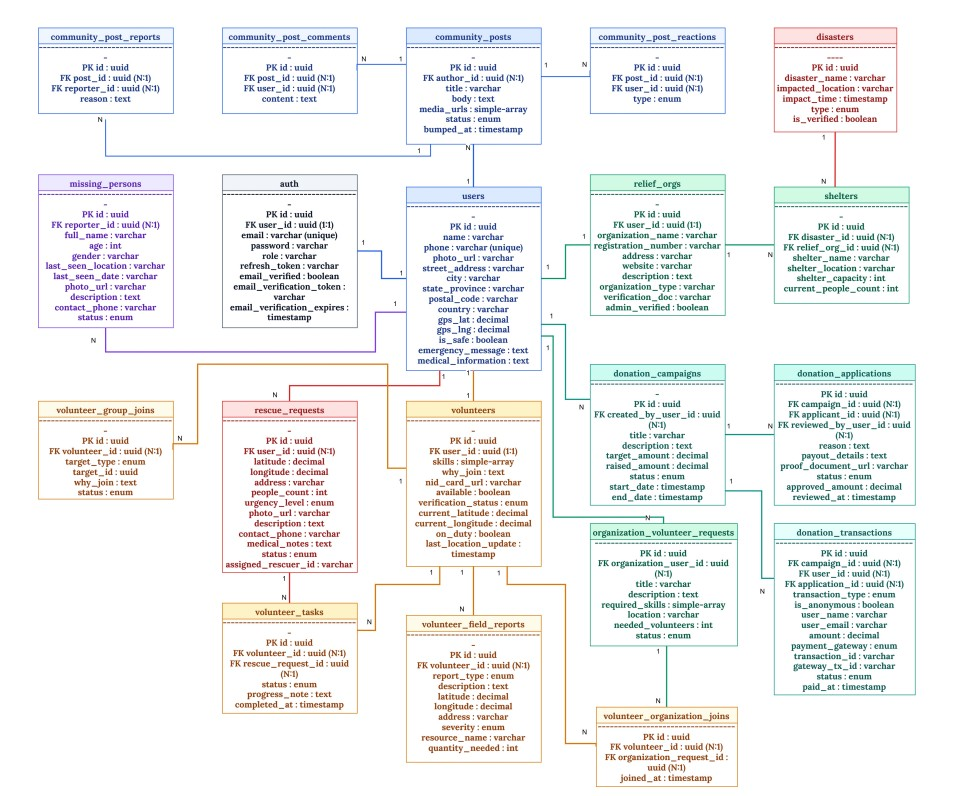

# Emergency Disaster Response & Management System

**September 2026**

**CSC4161: ADVANCED PROGRAMMING IN WEB TECHNOLOGY**

**Supervised By:** Md. Khairul Alam Mazumder

**Department of Computer Science**
**American International University - Bangladesh**

## Group 03
Contributors: 

[@AhmadZubayer](https://github.com/AhmadZubayer)           
[@Sohagsrz](https://github.com/Sohagsrz)                   
[@nayoncoc6-svg](https://github.com/nayoncoc6-svg)         
[@SMNahidHasanZisan](https://github.com/SMNahidHasanZisan) 

# 1. Project Overview

## 1.1 Problem Statement

During disasters, affected people, volunteers, and relief organizations often lack a centralized platform for effective communication and coordination. This project aims to combine emergency reporting, rescue operations, volunteer management, and relief distribution through an integrated web application.

## 1.2 System Roles

* Users
* Volunteers
* Relief Org
* Admin

## 1.3 Role-Based Functionalities

### Users

Users register and manage a personal profile, receive official disaster alerts, and save medical and emergency information. They report disasters with location, request rescue or assistance, share live location, and find nearby shelters or volunteers. Users can donate or request donations, submit missing-person reports, confirm safety with “I’m Safe,” and track rescue request status.

### Volunteers

Volunteers register and apply for verification, then add rescue skills and set availability. They see nearby matching requests, accept or reject tasks, share live location while on duty, and update task progress. Volunteers also report blocked routes or resource shortages and mark tasks completed.

### Relief Organizations

Relief organizations register and complete verification, publish official disaster alerts, and create/manage donations and volunteer groups. They assign volunteers and resources, manage relief camps and inventory, and monitor camp capacity and facilities. Organizations track operations and generate reports to coordinate relief efforts.

### Admins

Admins manage all accounts and verify or approve public warnings, posts, volunteers, and organizations. They review disaster reports and critical rescue requests, detect duplicates, monitor ongoing operations, and flag suspicious donation activity. Admins also moderate community content and generate disaster response reports.

---

# 2. Additional Features

## Frontend

* Zod for form validation
* OAuth for authentication
* AI Chatbot (Toolcalling) using Gemini API (Access to all public GET API only)
* Proxy for hiding backend endpoints
* Skeletons & loaders for all components
* Environment-based configuration using `.env`
* File upload (e.g., profile image or documents)
* Soft Deletetion & Trash
* PDF Generation using React PDF
* Stripe Integration
* Toast for confirmation for every action.
* Global custom error handling page, redirect to `/home` if not authorized
* Custom UI Library (Shadcn, Material UI, Universe io)
* Central Endpoint API Addressbook
* Dynamic Navbar with role-based navlinks.  

## Backend

* Email notification using Mailer
* Refresh Token authentication
* Custom decorators
* Global and custom exception handling
* Searching, sorting
* File upload (e.g., profile image or documents)
* API documentation using Swagger
* Logging using the NestJS Logger
* Audit logs (Created By, Updated By, Deleted By)
* Environment-based configuration using `.env` (NestJS Config)
* File upload (e.g., profile image or documents)
* Stripe Integration

---

# 3. Project Configuration

## Frontend

| Category             | Tool / Framework / Library        |
| -------------------- | --------------------------------- |
| Core Framework       | Next.js (App Router), React       |
| Language             | TypeScript                        |
| Styling & CSS        | Tailwind CSS                      |
| UI Component Systems | Shadcn UI, DaisyUI, Base UI       |
| Material Components  | Material UI (MUI - @mui/material) |
| AI Assistant         | Google Gemini Flash               |
| HTTP Client          | Axios                             |
| Interactive Maps     | Leaflet                           |
| Charts & Analytics   | Recharts                          |
| Document Generation  | @react-pdf/renderer               |
| Schema Validation    | Zod                               |
| Icons                | Lucide React                      |
| Sliders & Carousels  | Swiper                            |

## Backend

| Category            | Tool / Framework / Library                          |
| ------------------- | --------------------------------------------------- |
| Core Framework      | NestJS                                              |
| Language & Runtime  | TypeScript, Node.js                                 |
| Database            | PostgreSQL                                          |
| Database ORM        | TypeORM (@nestjs/typeorm)                           |
| Authentication      | Passport.js, JWT (@nestjs/jwt)                      |
| Auth Strategies     | Passport Local, Passport JWT, Passport Google OAuth |
| Password Encryption | bcrypt                                              |
| Mail Service / SMTP | Nodemailer, @nestjs-modules/mailer                  |
| Payment Gateway     | Stripe SDK                                          |
| File Uploads        | Multer                                              |
| API Documentation   | Swagger (@nestjs/swagger, swagger-ui-express)       |
| Environment Config  | @nestjs/config, dotenv                              |

---

# 4. Entity Relationship Diagram

---

# 5. Functional Requirements

| No       | Name                                                    | Frontend URL                     | Backend Endpoint                                                                                                                           | Authorization                                      |
| -------- | ------------------------------------------------------- | -------------------------------- | ------------------------------------------------------------------------------------------------------------------------------------------ | -------------------------------------------------- |
| **FR1**  | Current Disasters & Live Alert Feed                     | `/disaster`                      | `GET /disaster`                                                                                                                            | Public                                             |
| **FR2**  | Disaster Detailed View & Impact Zones                   | `/disaster/[id]`                 | `GET /disaster/:id`                                                                                                                        | Public                                             |
| **FR3**  | Missing Persons Public Directory & Search               | `/missing-persons`               | `GET /missing-persons`                                                                                                                     | Public                                             |
| **FR4**  | Missing Person Detailed Profile                         | `/missing-persons/[id]`          | `GET /missing-persons/:id`                                                                                                                 | Public                                             |
| **FR5**  | Public Rescue Requests & SOS Feed                       | `/rescue-requests`               | `GET /rescue-requests`                                                                                                                     | Public                                             |
| **FR6**  | Rescue Request Specific Details                         | `/rescue-requests/[id]`          | `GET /rescue-requests/:id`                                                                                                                 | Public                                             |
| **FR7**  | Donation Campaigns Directory                            | `/donations`                     | `GET /donations/campaigns`                                                                                                                 | Public                                             |
| **FR8**  | Specific Donation Campaign & Aid Application            | `/donations/[id]`                | `GET /donations/campaigns/:id` `POST /donations/campaigns/:id/donate` `POST /donations/campaigns/:id/apply`                          | Public / Authenticated User                        |
| **FR9**  | Community Discussion Forum & Ground Reports             | `/community`                     | `GET /community-posts`                                                                                                                     | Public                                             |
| **FR10** | Community Post Detailed View & Comments                 | `/community/[id]`                | `GET /community-posts/:id` `GET /community-posts/:id/comments` `POST /community-posts/:id/comments`                                  | Public / Authenticated User                        |
| **FR11** | Emergency Relief Shelters Directory                     | `/shelter`                       | `GET /shelter`                                                                                                                             | Public                                             |
| **FR12** | Gemini Flash AI Assistant Chatbot                       | Global UI Drawer                 | `POST /api/chat`                                                                                                                           | Public                                             |
| **FR13** | User Sign In                                            | `/sign-in`                       | `POST /auth/sign-in`                                                                                                                       | Public (Unauthenticated)                           |
| **FR14** | General User Sign Up                                    | `/sign-up`                       | `POST /auth/register-user`                                                                                                                 | Public (Unauthenticated)                           |
| **FR15** | Email Verification                                      | `/auth/callback`                 | `GET /auth/verify-email`                                                                                                                   | Public                                             |
| **FR16** | Volunteer Registration & Onboarding                     | `/volunteer-registration-form`   | `POST /volunteers/register`                                                                                                                | Authenticated User                                 |
| **FR17** | Relief Organization Registration & Verification Request | `/signup-as-relief-org`          | `POST /relief-org/sign-up-as-relief-org`                                                                                                   | Authenticated User                                 |
| **FR18** | User Profile & Personal Safety Status Toggle            | `/user/profile`                  | `GET /auth/me` `PATCH /users/update-profile` `POST /users/is-safe`                                                                   | Authenticated (USER, VOLUNTEER, RELIEF_ORG, ADMIN) |
| **FR19** | My Rescue Requests Management                           | `/user/rescue-requests`          | `GET /rescue-requests/my` `POST /rescue-requests` `PATCH /rescue-requests/:id/cancel`                                                | Authenticated User                                 |
| **FR20** | My Missing Person Reports                               | `/user/missing-persons`          | `GET /missing-persons/my` `POST /missing-persons` `PATCH /missing-persons/:id/status`                                                | Authenticated User                                 |
| **FR21** | My Community Posts & Discussions                        | `/user/community-posts`          | `GET /community-posts` `POST /community-posts` `DELETE /community-posts/:id`                                                         | Authenticated User                                 |
| **FR22** | User Donation History                                   | `/user/donations`                | `GET /donations/my-applications`                                                                                                           | Authenticated User                                 |
| **FR23** | User Aid Applications Status Tracking                   | `/user/applications`             | `GET /donations/my-applications`                                                                                                           | Authenticated User                                 |
| **FR24** | Volunteer Operational Profile & Status                  | `/volunteer/profile`             | `GET /volunteers/me` `PATCH /volunteers/me` `POST /volunteers/verification/apply`                                                    | VOLUNTEER                                          |
| **FR25** | Nearby Rescue Opportunities & Tasks                     | `/volunteer/opportunities`       | `GET /volunteers/rescue-requests/nearby` `POST /volunteers/rescue-tasks/:id/accept` `POST /volunteers/rescue-tasks/:id/reject`       | VOLUNTEER                                          |
| **FR26** | Volunteer Active Tasks & Progress Updates               | `/volunteer/profile` (Tasks Tab) | `GET /volunteers/rescue-tasks/my` `PATCH /volunteers/rescue-tasks/:taskId/progress` `POST /volunteers/rescue-tasks/:taskId/complete` | VOLUNTEER                                          |
| **FR27** | Ground Field Reports (Routes & Resource Shortages)      | `/volunteer/field-reports`       | `GET /volunteers/field-reports/my` `POST /volunteers/field-reports/routes` `POST /volunteers/field-reports/shortages`                | VOLUNTEER                                          |
| **FR28** | Relief Organization Requests & Group Joins              | `/volunteer/groups`              | `GET /volunteers/organization-requests` `POST /volunteers/organization-requests/:id/join` `GET /volunteers/group-joins/my`           | VOLUNTEER                                          |
| **FR29** | Organization Profile & Credential Management            | `/relief-org/profile`            | `GET /relief-org/profile/me` `PATCH /relief-org/profile/me`                                                                             | RELIEF_ORG                                         |
| **FR30** | Disaster Alerts & Crisis Creation                       | `/relief-org/manage-disaster`    | `GET /disaster` `POST /disaster`                                                                                                        | RELIEF_ORG, ADMIN                                  |
| **FR31** | Create & Manage Donation Campaigns                      | `/relief-org/manage-donations`   | `GET /donations/campaigns` `POST /donations/campaigns`                                                                                  | RELIEF_ORG                                         |
| **FR32** | Review Aid Applications from Victims                    | `/relief-org/applications`       | `GET /donations/applications` `PATCH /donations/applications/:id/review`                                                                | RELIEF_ORG                                         |
| **FR33** | Coordinate Volunteer Groups & Deployments               | `/relief-org/manage-volunteers`  | `GET /volunteers` `POST /volunteers/organization-requests`                                                                              | RELIEF_ORG                                         |
| **FR34** | Review Volunteer Field Reports & Shortages              | `/relief-org/volunteer-reports`  | `GET /volunteers/field-reports/my`                                                                                                         | RELIEF_ORG                                         |
| **FR35** | Admin Dashboard Metrics & Analytics                     | `/admin`                         | `GET /admin/reports` `GET /admin/accounts`                                                                                              | ADMIN                                              |
| **FR36** | Account Management & Role Assignment                    | `/admin/accounts`                | `GET /admin/accounts` `PATCH /admin/accounts/:id/role` `DELETE /admin/accounts/:id` `PATCH /admin/accounts/:id/restore`           | ADMIN                                              |
| **FR37** | Volunteer Verification & Credential Review              | `/admin/volunteers`              | `GET /admin/volunteers` `PATCH /admin/volunteers/:id/verify`                                                                            | ADMIN                                              |
| **FR38** | Relief Organization Verification & Audit                | `/admin/relief-orgs`             | `GET /admin/relief-orgs` `PATCH /admin/relief-orgs/:id/verify`                                                                          | ADMIN                                              |
| **FR39** | Disaster Alerts Moderation & Official Verification      | `/admin/disasters`               | `GET /admin/disasters` `PATCH /admin/disasters/:id/verify`                                                                              | ADMIN                                              |
| **FR40** | Rescue Requests Global Oversight                        | `/admin/rescue-requests`         | `GET /admin/rescue-requests` `PATCH /rescue-requests/:id/status`                                                                        | ADMIN                                              |

---

